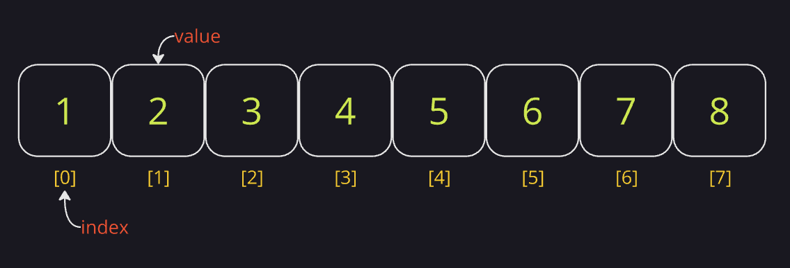
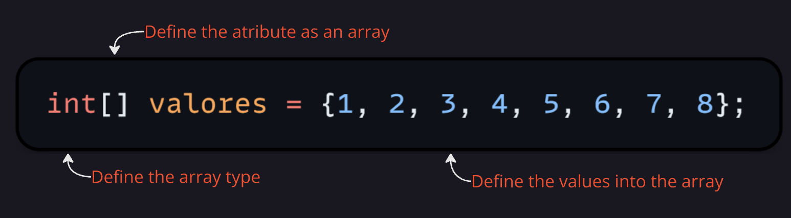

#dsa 

### O que é um Array

-> Estrutura de dados que permite armazenar um conjunto de elementos do mesmo tipo em uma sequência de memória.
-> Os elementos são acessados usando um __índice__, começando em _zero_.
-> O tamanho do Array deve ser definido __no momento que é criado__.
-> Arrays tem __tamanho fixo__ e, após inicializado, não pode ser redimensionado.

### Visualização gráfica de um Array



### Prós e Contras

| Onde usar                    | Onde não usar                   |
| ---------------------------- | ------------------------------- |
| Tarefas de baixo nível       | Tamanho variável de dados       |
| Dados de tamanhos fixos      | Tipos de dados diferentes       |
| Todos os dados do mesmo tipo | Busca frequente de dados        |
| Operações matemáticas        | Concorrência de processos       |
| Matrizes                     | Se tiver objetos não-primitivos |
| Dados de tipo primitivo      |                                 |

### Arrays no Csharp

#### Criando Array Simples (unidimensional)

Tipo 1 - Valores pré-definidos

```csharp
int[] valores = {1, 2, 3, 4, 5, 6, 7, 8};
```

Entendendo esse código:



