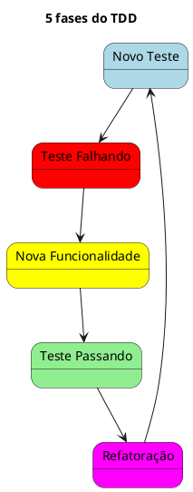

### Breve descrição

__TDD__ é uma prática de desenvolvimento de software onde os testes são escritos antes do código funcional. Isso ajuda a garantir que o código atenda aos requisitos desde o início e facilita a identificação de bugs.

__TDD__ foi criado para auxiliar no desenvolvimento de códigos mais concisos, com menos dependências e acoplamentos, reduzindo a incidência de erros na aplicação.

__TDD__ significa Test-Driven Development ou em português Desenvolvimento Orientado a testes e se refere a uma abordagem de desenvolvimento que trabalha com pequenos ciclos de repetições, onde são criados __testes__ para cada funcionalidade que será implementada no software.

> [!IMPORTANT] Ideia por trás disso
> Com os testes criados antes da função faz com que a pessoa desenvolvedora tenha mais facilidade para entender o que supostamente o código deve fazer e possa implementar a funcionalidade já pensando em como o teste vai passar.

### Como funciona o TDD

1. Se inicia com a criação de um teste para cada nova funcionalidade da aplicação. Além disso o ciclo envolve 5 etapas diferentes, como mostra o diagrama:

